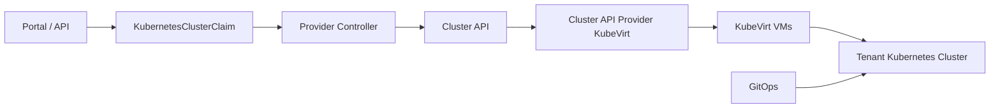

# Tenant Kubernetes Clusters

Tenant Kubernetes clusters are a first-class provider product. They should be
managed through Cluster API so creation, upgrade, scaling, and deletion are
declarative and auditable.

## Architecture



## Responsibilities

| Component | Responsibility |
| --- | --- |
| `KubernetesClusterClaim` | Tenant-facing request and status |
| Provider controller | Quota, placement, policy, template selection |
| Cluster API | Cluster lifecycle and rolling upgrades |
| CAPK | VM infrastructure for control plane and workers |
| GitOps | Tenant cluster add-ons, policy, observability |
| Portal | Create, scale, upgrade, credential, delete UX |

## Isolation

Default tenant clusters should run in one of these modes:

- dedicated tenant namespace plus KubeVirt VMs for small trusted clusters;
- dedicated node pool for noisy or sensitive tenant clusters;
- dedicated capacity cell for regulated or very high-load tenants.

Tenant cluster kubeconfigs must be short-lived or rotated. Provider admins
retain break-glass access with audit.

## Lab Artifacts

- `iac/cluster-api/install-capi-capk.sh`
- `iac/cluster-api/tenant-cluster-template.yaml`
- `iac/scripts/install-tenant-cni.sh`
- `iac/scripts/verify-tenant-control-plane-restart.sh`
- `iac/scripts/install-cdi.sh`
- `iac/scripts/verify-cdi-storage.sh`
- `iac/kubernetes/provider-api/crds.yaml`
- `iac/scripts/verify-tenant-cluster-layer.sh`

Current lab status:

- Cluster API providers are installed by `clusterctl`:
  `cluster-api v1.13.2`, kubeadm bootstrap/control-plane `v1.13.2`, and
  CAPK `v0.11.2`.
- The provider controller reconciles `KubernetesClusterClaim` into CAPI/CAPK
  resources: `Cluster`, `KubevirtCluster`, `KubeadmControlPlane`,
  `KubevirtMachineTemplate`, `KubeadmConfigTemplate`, and `MachineDeployment`.
- The current live `tenant-a/routable-cluster` claim creates a CAPK-managed
  control-plane KubeVirt VM, completes kubeadm bootstrap, and reaches CAPI/KCP
  `Available` with the tenant node `Ready`.
- Cilium `1.19.5` is installed into the tenant cluster by a provider-side Job
  in `capk-system` using a temporary direct kubeconfig secret. The tenant-facing
  kubeconfig remains in the tenant namespace.
- CDI `v1.65.0` is installed and verified against Longhorn with a blank
  DataVolume import smoke test. The management HA script sets CDI operand
  replicas through `CDI.spec.infra.apiServerReplicas`,
  `deploymentReplicas`, and `uploadProxyReplicas` so the CDI operator owns the
  desired state.
- CAPK tenant cluster nodes use CDI `DataVolume` root disks backed by Longhorn
  instead of ephemeral `containerDisk` roots. The routable cluster restart drill
  proves that DataVolume import, Cilium installation, VMI restart, PVC UID
  preservation, CAPI Machine recovery, routed API recovery, and stale tenant
  `kube-system` pod cleanup work after the KubeVirt pod IP changes. Routed API
  endpoints are recovered through provider gateway pods placed away from the
  tenant VMI host node.
- The provider controller creates `allow-cdi-importer-egress` in tenant
  namespaces so CDI importer pods can pull registry images while the namespace
  remains default-deny for unrelated traffic.

The demo keeps worker replicas at `0` by default to fit the current Hyper-V
resource envelope. The provider controller records capacity admission against
`CapacityCell lab-hyperv` and caps worker pools with both the cell limit and
`MAX_TENANT_CLUSTER_WORKERS_PER_POOL=0` in the lab deployment. A test scale to
one worker is admitted only as an effective `0` replicas request:
`KubernetesClusterClaim.status.admission.reason=WorkerReplicasCapped`,
MachineDeployment replicas stay `0`, and no worker VMI is created. Production
service classes should use 3 or 5 control-plane replicas and at least one worker
pool once larger cells and multi-control-plane placement are in place.

The API already models that production shape. `CapacityCell` service classes can
declare tenant-cluster control-plane replica bounds. The lab publishes
`ha-tenant-kubernetes` with a 3/5 control-plane intent, while
`lab-hyperv.spec.limits.maxControlPlaneReplicas=1` keeps the current tiny cell
from overcommitting itself. The provider API verifier creates a temporary
3-control-plane claim and expects `ControlPlaneReplicaLimitExceeded` with no
backing CAPI resources.

The previous legacy `tenant-a/demo-cluster` containerDisk instance was deleted
and recreated through the same claim contract after a VMI reset exposed the
expected ephemeral-root failure mode. Later, the duplicate `demo-cluster` was
removed from the live footprint after n1 resource pressure degraded etcd
readiness in the tiny Hyper-V profile. Use `routable-cluster` as the active
persistent-root validation target.

Tenant cluster bootstrap needs provider-managed network exceptions. The lab
controller creates `allow-capi-<cluster>` NetworkPolicy for the tenant cluster
VM pods so CAPI/CAPK controllers can reach SSH and the workload API while the
tenant namespace remains default-deny for unrelated traffic. Provider-managed
add-on installers run from provider namespaces instead of tenant namespaces.
The lab now creates a provider-managed tenant API gateway per tenant cluster in
`capk-system`. The gateway is a small Python TCP proxy Deployment fronted by a
MetalLB `LoadBalancer` Service, while the raw CAPK control-plane Service
remains internal `ClusterIP` in the tenant namespace and tenant-created
LoadBalancers remain denied by policy. This models the production requirement
for a provider owned routed endpoint instead of exposing raw substrate Services.
The lab controller schedules proxy replicas on the configured provider gateway
pool `TENANT_API_PROXY_NODE_HOSTNAMES=n1,n3`, avoids the tenant VMI host node to
bypass KubeVirt masquerade hairpin failures, caps replicas with
`TENANT_API_PROXY_MAX_REPLICAS`, and uses required pod anti-affinity so replicas
land on distinct hostnames when two candidates exist. Gateway Services use
`externalTrafficPolicy=Cluster` so the routed MetalLB VIP is reachable from all
provider/controller nodes even when the raw CAPK ClusterIP path is
hairpin-sensitive on the VMI host.
Each provider gateway also has a provider-owned `PodDisruptionBudget` with
`minAvailable=1`. On the current single-replica demo gateway this intentionally
blocks voluntary eviction; on two-replica gateways it permits one proxy pod to be
disrupted while keeping the tenant API routed path alive during node maintenance.

Generated gateway objects use the name pattern
`<tenant-namespace>-<cluster-name>-api` and labels
`app=tenant-api-proxy`,
`platform.privatecloud.local/tenant-namespace=<tenant-namespace>`, and
`platform.privatecloud.local/cluster=<cluster-name>`. Inspect them with:

```bash
kubectl -n capk-system get svc,deploy -l app=tenant-api-proxy -o wide
kubectl -n capk-system get svc,deploy tenant-a-claim-routable-cluster-api -o wide
```

Current evidence: `tenant-a/routable-cluster` is reachable through
`172.28.10.102:6443` from the Windows host and provider verification jobs. Read
the live endpoint from `KubernetesClusterClaim.status.apiEndpoint` before
manual testing because MetalLB can assign a new address after claim recreation.
Current lab placement has the `routable-cluster` gateway `2/2` on n1/n3 because
its VMI is on n2. The gateway PDB selects `app=tenant-api-proxy` and requires
`minAvailable=1`. The claim reports `status.endpointReachable=true`,
`status.endpointProbeReachable=true`, `status.endpointFailureCount=0`,
`EndpointReachable=True`, and published `status.apiEndpoint`. The provider
controller probes `/readyz` through the routed endpoint, keeps the last known
endpoint for up to `TENANT_API_READYZ_FAILURE_THRESHOLD` transient failures,
and suppresses `status.apiEndpoint` only after repeated failures.

Nested Hyper-V bootstrap is slower than a normal bare-metal cell. New tenant
clusters therefore render kubeadm v1beta4 `timeouts` for init and join phases:
`controlPlaneComponentHealthCheck=10m0s`, `kubeletHealthCheck=6m0s`,
`discovery=10m0s`, `tlsBootstrap=10m0s`, and `kubernetesAPICall=2m0s` by
default. The provider controller exposes these as environment overrides with
the `TENANT_KUBEADM_*_TIMEOUT` names. This avoids a known failure mode where
the API became healthy just after kubeadm's default four-minute control-plane
component health check expired.

For the current KubeVirt masquerade lab path, the tenant CNI installer can pass
the tenant node's internal API address into the Cilium Helm chart with
`CILIUM_K8S_SERVICE_HOST` and `CILIUM_K8S_SERVICE_PORT`. Production cells should
replace this with a tenant-internal HA API endpoint reachable from every tenant
node before CNI is up.

Deletion is reconciled through the provider claim finalizer. The
`verify-claim-lifecycle.sh` test creates a temporary admitted
`KubernetesClusterClaim`, confirms reservation, CAPI/CAPK resources, internal
API Service, provider gateway Service/Deployment, and NetworkPolicy exist, then
deletes the claim and verifies all of those provider-owned resources are gone.

Tenant control-plane restart recovery is covered by an explicit destructive
drill:

```bash
CONFIRM_TENANT_CP_RESTART=true \
CLUSTER_CLAIM_NAME=routable-cluster \
iac/scripts/verify-tenant-control-plane-restart.sh
```

The script refuses to run without the confirmation flag. It deletes only the
CAPK control-plane VMI, waits for KubeVirt to recreate it with a new VMI UID,
asserts that the Longhorn root PVC UID is unchanged, waits for CAPI/KCP/Machine
and `KubernetesClusterClaim` readiness, verifies routed `/readyz`, force-cleans
stale `Unknown`/`Failed`/`Terminating` tenant `kube-system` pods left by the
hard restart, waits for the namespace to settle back to Running/Succeeded pods,
and then runs the normal tenant layer and routed reachability verifiers.
