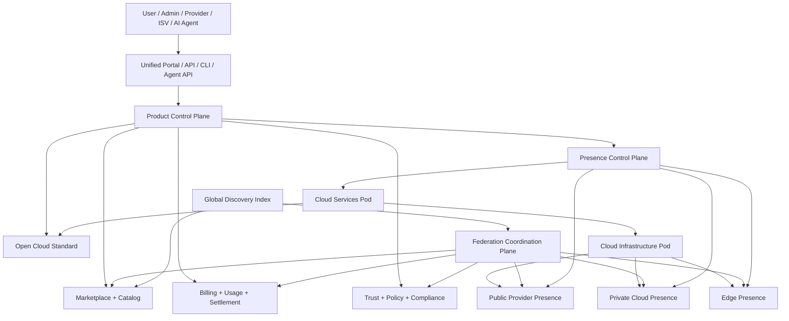

# Reference Architecture

Этот документ описывает целевую архитектуру CloudRING как "cloud of clouds".
Она должна быть достаточно простой для одного человека с AI-агентами и
достаточно мощной для крупнейших мировых компаний, публичных провайдеров,
частных облаков и edge-сетей.

Архитектура не должна зависеть от одной технологии.
Любой слой может иметь несколько реализаций, если сохраняет контракт.

## Архитектурная Формула

CloudRING = Open Cloud Standard + Service Lifecycle + Infrastructure Pods +
Cloud Services Pods + Federation Network + Marketplace + Billing/Settlement +
Trust/Policy Layer + Agent-Operated Self-Service.

## Слои Архитектуры

### 1. Experience Layer

Поверхность для пользователей, администраторов, провайдеров, разработчиков и
AI-агентов.

Capability:

- Unified Cloud Portal.
- Public API.
- CLI.
- Agent API.
- Documentation and runbooks.
- Marketplace UI.
- Observability and audit views.

Требования:

| ID | Требование | Почему |
|---|---|---|
| CR-ARCH-001 | Все основные пользовательские действия должны иметь единый intent contract и быть доступны через UI, API, CLI и Agent API там, где stage обещает эти поверхности. | Self-service не должен зависеть от одного интерфейса или расходиться по смыслу между человеком и агентом. |
| CR-ARCH-002 | Agent API должен быть first-class, а не automation поверх кликов. | Платформа строится для управления человеком и AI-агентами. |
| CR-ARCH-003 | UI должен быть простым: пользователь видит выбор, состояние, цену, риски и действие, а не внутреннюю сложность federation. | Сложная платформа должна ощущаться цельной. |
| CR-ARCH-004 | Portal должен поддерживать micro-frontend/service UI, но контролировать permissions, theme, navigation и lifecycle. | Сервисы должны расширять опыт, не разрушая продуктовую целостность. |

### 2. Product Control Plane

Слой, который управляет сервисами как продуктами.

Capability:

- Catalog.
- Orders.
- Service instances.
- Lifecycle orchestration.
- Plans and SKUs.
- Entitlements.
- Usage registration.
- Support and maintenance state.

Требования:

| ID | Требование | Почему |
|---|---|---|
| CR-ARCH-005 | Сервис в CloudRING должен быть продуктовой сущностью, а не только deployment-артефактом. | Marketplace и billing работают с продуктом, а не с pod/container. |
| CR-ARCH-006 | Product Control Plane должен знать service instance, owner, provider, plan, region, jurisdiction, SLA, dependencies, lifecycle state и связанный Presence Control Plane. | Это минимальный контекст управления услугой без присвоения локального ownership глобальным слоям. |
| CR-ARCH-007 | Presence Control Plane должен сохранять локальную историю lifecycle-событий сервиса и публиковать только scoped summary в federation/global layers. | Миграция, аудит, support и billing требуют событийной истории, но federation не должна забирать всю operational truth. |
| CR-ARCH-008 | Policy engine должен работать на границе владельца действия: product, presence, federation or global discovery. | Не все пользователи, регионы, участники, сервисы и состояния доверия имеют одинаковые права. |

### 3. Open Cloud Standard Layer

Слой контрактов.

Capability:

- Service manifest.
- Capability schema.
- Lifecycle API schema.
- Usage metric schema.
- Dependency schema.
- Policy and compliance schema.
- Compatibility tests.

Требования:

| ID | Требование | Почему |
|---|---|---|
| CR-ARCH-009 | Open Cloud Standard должен быть независимым от конкретного runtime. | Runtime может меняться, контракты должны жить дольше. |
| CR-ARCH-010 | Стандарт должен быть проверяемым через conformance tests. | Нельзя строить federation на обещаниях совместимости. |
| CR-ARCH-011 | Стандарт должен иметь версии, migration path и deprecated policy. | Глобальная сеть не обновляется одновременно. |
| CR-ARCH-012 | Стандарт должен позволять описывать как infrastructure service, так и бизнес-сервис. | Marketplace должен включать разные классы продуктов. |

## Canonical Control-Plane Vocabulary

| Term | Product Meaning | Must Not Mean |
|---|---|---|
| Product Control Plane | Логический слой product lifecycle: service, offer, order, instance, support, usage links and readiness. | Единственный владелец runtime, data plane or local audit. |
| Presence Control Plane | Локальный владелец lifecycle, policy, health, emergency actions and audit inside one public/private/edge/local presence. | Глобальный SaaS-зависимый выключатель private/edge operations. |
| Federation Coordination Plane | Scoped sync, participant registry, trust, catalog, usage/settlement evidence and dispute coordination between participants. | Центральный runtime owner for all participants. |
| Global Portal And Discovery Index | Search, comparison, portfolio view, ranking explanation and policy-aware discovery across the network. | Копия всех локальных control planes or universal lifecycle authority. |

### 4. Cloud Services Pod

Слой сервисов, которые продаются, публикуются, подключаются и используются.

Capability:

- Platform services.
- Partner services.
- Enterprise services.
- Multi-cloud services.
- Development services.
- Documentation services.
- Service UI.
- Service connector.

Требования:

| ID | Требование | Почему |
|---|---|---|
| CR-ARCH-013 | Cloud Services Pod должен быть одинаковой концепцией для public, private и edge. | Сервис должен быть переносимым между presence. |
| CR-ARCH-014 | Сервис может быть open, enterprise, partner, private-only или federation-ready. | Разные бизнес-модели не должны ломать общий lifecycle. |
| CR-ARCH-015 | Каждый сервис должен иметь declared capability и compatibility profile. | Пользователь и агент должны понимать, где сервис можно использовать. |
| CR-ARCH-016 | Сервис должен уметь зависеть от других сервисов через контракт, а не через ручную инструкцию. | Это позволяет автоматический provisioning и portability. |

### 5. Cloud Infrastructure Pod

Слой, который предоставляет ресурсы.

Capability:

- IAM and Resource Manager.
- Compute.
- Network.
- Storage.
- Bare metal.
- VM platform.
- Container platform.
- Public cloud connectors.
- Monitoring and alerting agents.
- Billing agents.
- Security agents.

Требования:

| ID | Требование | Почему |
|---|---|---|
| CR-ARCH-017 | Infrastructure Pod должен скрывать различия поставщиков за общими resource contracts. | Это ядро ухода от provider lock-in. |
| CR-ARCH-018 | Infrastructure Pod должен поддерживать несколько backend-реализаций одной capability. | Платформа не должна устаревать вместе с одним стеком. |
| CR-ARCH-019 | Infrastructure Pod должен публиковать capacity, health, pricing inputs, location и policy attributes. | Scheduler и пользователь должны выбирать осознанно. |
| CR-ARCH-020 | Infrastructure Pod должен поддерживать local/single-host профиль как младший профиль, а не отдельный продукт. | Путь от dev к production должен быть непрерывным. |

### 6. Federation Layer

Слой сети CloudRING.

Capability:

- Participant registry.
- Catalog synchronization.
- Event bus.
- Cross-cloud connect.
- Settlement exchange.
- Trust and certification.
- Dispute and suspension mechanisms.

Требования:

| ID | Требование | Почему |
|---|---|---|
| CR-ARCH-021 | Federation Layer должен позволять участникам обмениваться каталогами, событиями и расчетами без ручных интеграций. | Иначе глобальная сеть не масштабируется. |
| CR-ARCH-022 | Federation Layer должен поддерживать partial trust и scoped data sharing. | Участники не должны раскрывать больше, чем нужно. |
| CR-ARCH-023 | Federation Layer должен поддерживать local autonomy: private/edge участник продолжает работать при потере связи. | CloudRING должен быть устойчивым к network и jurisdiction events. |
| CR-ARCH-024 | Federation Layer должен иметь governance и conformance gates. | Открытость без качества разрушает доверие. |

### 7. Trust, Security And Policy Layer

Поперечный слой.

Capability:

- Identity.
- Authorization.
- Secret management.
- Audit.
- Policy engine.
- Compliance profiles.
- Data residency.
- Supply chain verification.
- Service certification.

Требования:

| ID | Требование | Почему |
|---|---|---|
| CR-ARCH-025 | Security and policy должны быть встроены во все lifecycle-действия. | Без этого federation становится неконтролируемым риском. |
| CR-ARCH-026 | Data residency и jurisdiction policy должны участвовать в placement до provisioning. | Исправлять размещение после факта может быть невозможно. |
| CR-ARCH-027 | Marketplace service должен проходить security/capability validation перед публикацией. | Пользователь доверяет платформе как куратору качества. |
| CR-ARCH-028 | Все agent actions должны иметь identity, permissions, audit и rollback/compensation model. | Агентам нельзя давать неограниченную невидимую власть. |

### 8. Operations And Knowledge Layer

Слой автономной поддержки.

Capability:

- Runbooks.
- ADR.
- Requirements.
- Incidents.
- SLO/SLA.
- Telemetry.
- Change plans.
- Agent task plans.
- Knowledge graph.

Требования:

| ID | Требование | Почему |
|---|---|---|
| CR-ARCH-029 | Платформа должна хранить machine-readable знания о требованиях, решениях и операциях. | AI-агенты должны понимать систему, а не только исполнять команды. |
| CR-ARCH-030 | Каждое изменение production/private/federation должно иметь plan, execution log и validation result. | Это основа безопасной автономной эксплуатации. |
| CR-ARCH-031 | Runbook должен иметь human-readable и agent-readable форму. | Одна процедура должна работать для человека и агента. |
| CR-ARCH-032 | Архитектура должна поддерживать continuous improvement loop из incident -> requirement -> ADR -> implementation -> validation. | Платформа должна становиться лучше после каждого опыта. |

## Минимальная Целевая Топология

## Архитектурные Анти-Цели

CloudRING не должен:

- становиться новым закрытым hyperscaler;
- требовать одного runtime для всех сценариев;
- превращать private/edge в неполноценные демо-режимы;
- заставлять ISV быть участниками второго класса;
- строить коммерческую модель на невозможности уйти;
- прятать billing, placement или data residency от пользователя;
- требовать большой команды операторов для базовой поддержки;
- делать AI-агентов опасными суперпользователями без политики и аудита.
