# Agent Workstream Backlog

Этот backlog переводит требования CloudRING в agent-readable product workstreams.
Он не выбирает технологии и не описывает реализацию. Его задача - показать, какие
потоки работ должны существовать, какие результаты они дают, какие требования и
readiness profiles ими управляют, и где агент обязан остановиться.

## Workstream Requirements

| ID | Требование | Почему | Acceptance |
|---|---|---|---|
| CR-WORK-001 | Каждый workstream должен иметь product outcome and stage target. | Иначе агент будет оптимизировать локальную задачу вместо продукта. | Workstream lists outcome, users, stage and readiness profile. |
| CR-WORK-002 | Workstream must link to requirements, ADR and conformance. | Agent must work from product memory, not guesses. | Workstream includes requirement_refs, adr_refs and conformance_refs. |
| CR-WORK-003 | Workstream must define dependencies and blocked-by relationships. | CloudRING capabilities are layered. | Workstream has upstream dependencies and downstream consumers. |
| CR-WORK-004 | Workstream must name expected evidence. | Done means proven, not merely edited. | Workstream includes evidence outputs and validation target. |
| CR-WORK-005 | Workstream must define stop conditions. | Agent should stop before violating trust, policy or scope. | Stop conditions include missing ADR, approval, ownership, policy or evidence. |
| CR-WORK-006 | Workstream must distinguish product backlog from implementation task. | Requirements folder stores what/why, not code plan. | Workstream describes outcomes and gates, not framework-specific steps. |
| CR-WORK-007 | Workstream must preserve anonymization and source safety. | Future source intake cannot leak old context. | Source-derived tasks include anonymization and copyright-safe checks. |
| CR-WORK-008 | Workstream must be usable by one human with multiple AI agents. | This is core operating model. | Workstream has clear ownership, parallelizable slices and review gates. |

## Workstream Object Shape

```yaml
id: WS-000
status: draft | active | blocked | complete | superseded
title: Product workstream
product_outcome: What must become true
why: Why this matters for CloudRING
primary_users:
  - role
agent_roles:
  - analysis
  - implementation
  - verification
mode: investigate | plan | implement | verify | operate
risk_class: read-only | safe-change | controlled-change | risky-change | destructive | emergency
stage_target: Stage N
stage_scope:
  - STAGE-000
capability_refs:
  - capability cluster
requirement_refs:
  - CR-...
adr_refs:
  - ADR-...
conformance_refs:
  - profile-id
dependencies:
  upstream:
    - WS-...
  downstream:
    - WS-...
expected_evidence:
  - evidence type
template_refs:
  - requirements/templates/template-file.md
conformance_report_refs:
  - profile report or future report id
evidence_bundle_refs:
  - evidence-bundle-id
coverage_manifest_refs:
  - source coverage manifest or not-applicable
validation_summary:
  - required validation summary type
approval:
  allowed_actions:
    - read-only
  required_approvals:
    - owner
  forbidden_actions:
    - unsafe mutation
rollback_or_compensation:
  - expected rollback, compensation or irreversible warning
agent_boundaries:
  allowed:
    - read-only analysis
    - safe draft
  forbidden:
    - unsafe change
stop_conditions:
  - missing owner/ADR/policy/evidence
```

## Workstreams

| ID | Title | Product Outcome | Stage Target | Key Dependencies | Readiness Target |
|---|---|---|---|---|---|
| WS-001 | Requirements And Knowledge Memory | Product memory contains mission, sources, requirements, ADR, stages, conformance and agent rules. | Stage 0 | Source Analysis, Governance | `stage0-requirements-memory-ready`; `stage7-self-evolving-ready` for evolution loop |
| WS-002 | Open Cloud Standard Contract | Services and capabilities are described through portable contracts independent of runtime. | Stage 1 | Requirements Memory | `stage1-service-ready` |
| WS-003 | Service Factory And Local Runtime | Developer creates, runs, observes, documents and validates a service locally. | Stage 1 | Open Cloud Standard | `stage1-service-ready` |
| WS-004 | Agent Safety And Approval | Agents can read, plan, validate and execute scoped work without hidden root power. | Stage 1 | Knowledge Memory, Approval Matrix | All profiles |
| WS-005 | Private Presence Foundation | Admin installs autonomous private presence with IAM, resource ownership, policy, health and recovery. | Stage 2 | Service Factory, Infrastructure | `stage2-private-presence-ready` |
| WS-006 | Infrastructure Capability Profiles | Compute, network, storage, backup and observability become replaceable capability profiles. | Stage 2 | Private Presence, Policy | `stage2-private-presence-ready` |
| WS-007 | Private Service Store | Private cloud installs, updates, licenses, supports and removes ready services. | Stage 3 | Open Cloud Standard, Private Presence | `stage3-private-store-ready` |
| WS-008 | Marketplace Certification And Service Cards | Buyer/admin/ISV can evaluate service trust, compatibility, portability, price and support before install/order. | Stage 3 | Store, Conformance, Experience | `stage3-private-store-ready` |
| WS-009 | Public Provider Presence | Independent provider onboards, publishes offers, serves tenants and operates support/SLA. | Stage 4 | Marketplace, IAM, Infrastructure | `stage4-public-provider-ready` |
| WS-010 | Usage Billing Credits And Disputes | Orders, usage, entitlements, invoices, credits and disputes are evidence-linked. | Stage 4 | Provider Presence, Audit | `stage4-public-provider-ready` |
| WS-011 | Federation Sync And Participant Registry | Independent presence exchange catalog, trust, usage and support metadata with scoped sync. | Stage 5 | Provider Presence, Private Presence, Billing | `stage5-federation-ready` |
| WS-012 | Cross-Provider Operations | Backup, replication, migration, DR and support handoff work across participants with policy and rollback. | Stage 5 | Federation, Portability, Policy | `stage5-federation-ready` |
| WS-013 | Global Discovery And Policy | Global portal/API compares offers across participants and jurisdictions without owning all control planes. | Stage 6 | Federation, Trust, Policy | `stage6-global-ready` |
| WS-014 | Global Settlement Trust And Governance | Global network manages trust, settlement, disputes, downgrades and scoped governance. | Stage 6 | Federation, Billing, Conformance | `stage6-global-ready` |
| WS-015 | Continuous Evolution Loop | Signals become requirements, ADR, runbooks, checks and validated learning. | Stage 7 | Knowledge Memory, Conformance, Agents | `stage7-self-evolving-ready` |
| WS-016 | Conformance And Readiness System | Every stage and major capability has evidence-based readiness profile and report. | Stage 1-7 | Requirements, Stages, ADR | All profiles |
| WS-017 | Experience Simplicity Standard | UI/API/CLI/Agent API flows stay intent-first, explain consequences and avoid visible platform complexity. | Stage 1-7 | ADR-0012, Experience Standard | All profiles |
| WS-018 | Security Trust And Source Safety | Secrets, tenant data, source-derived knowledge and trust boundaries remain protected. | Stage 1-7 | Security ADR, Governance | All profiles |
| WS-019 | End-To-End Architecture Integration | Cross-layer role journeys, presences, marketplace, billing, trust, exit, operations and learning loops stay coherent across all stages. | Stage 0-7 | Requirements, Stages, Capability Contracts, Conformance | All profiles |
| WS-020 | Exhaustive Source Coverage Audit | Legacy and future source bundles are analyzed through bounded slices with coverage manifest, source-safety gates and requirement/conformance updates. | Stage 0-7 | Source Analysis, Coverage Manifest, Governance | `stage0-requirements-memory-ready`; `stage7-self-evolving-ready` |
| WS-021 | Specification Templates And Scenario Fixtures | Agent-readable templates and synthetic role scenarios make readiness evidence reproducible without old source context. | Stage 0-7 | Requirements, Conformance, Source Coverage | `stage0-requirements-memory-ready`; all profiles through role coverage matrix |
| WS-022 | Product Design Quality And Scenario Depth | Task-based design quality reviews prove visible consequences, alternatives, negative paths, provider economics, jurisdiction overlays and human-agent parity. | Stage 0-7 | Experience, Scenario Fixtures, Conformance, Metrics | All profiles through product design quality review |
| WS-023 | OCS Information Model And Schema Governance | OCS artifact kinds, canonical fields, extension lifecycle, compatibility classes and conformance suite make the standard reimplementation-ready. | Stage 1-7 | Open Cloud Standard, Conformance, Governance | `stage1-service-ready`; all OCS-compatible profiles |
| WS-024 | Lifecycle Command Surface Evidence | Commands, API actions and agent actions become lifecycle contracts with preflight, risk, structured result, cleanup, task/plugin boundaries and support evidence. | Stage 1-7 | Open Cloud Standard, Service Factory, Agent Operations | `stage1-service-ready`; all command-exposing profiles |
| WS-025 | Billing Runtime Evidence And Settlement Trust | Billable usage becomes receipt/status, idempotency, replay/quarantine, release-history and settlement-freeze evidence instead of opaque intake success. | Stage 4-6 | Billing, Federation, Conformance, Source Coverage | `stage4-public-provider-ready`; `stage5-federation-ready`; `stage6-global-ready` |
| WS-026 | Stateful Restore And Failover Readiness | Backup, restore, PITR, failover, endpoint ownership, audit findings and source-safe recovery evidence become reusable readiness proof. | Stage 2-6 | Infrastructure, Observability, Portability, Conformance, Source Coverage | `stage2-private-presence-ready`; `stage4-public-provider-ready`; `stage5-federation-ready` |
| WS-027 | Documentation And Decision Memory Evidence | Docs, ADR/no-ADR rationale, source-pass lessons, feedback, templates, examples, scenarios and conformance gates become one source-safe product memory chain. | Stage 0-7 | Requirements Memory, Source Coverage, Scenario Fixtures, Conformance | `stage0-requirements-memory-ready`; `stage1-service-ready`; `stage7-self-evolving-ready` |
| WS-028 | Secret Runtime Readiness Evidence | Encrypted secret declarations, scope binding, key custody, reconciliation, install/delete, RBAC, health/metrics, rotation and degraded/fail-closed behavior become reusable source-safe readiness proof. | Stage 2-6 | Security, Infrastructure, Conformance, Source Coverage | `stage2-private-presence-ready`; `stage4-public-provider-ready`; `stage5-federation-ready` |
| WS-029 | Service Dependency Deployment Model Evidence | Service dependency graph, effective profiles, generated artifacts, env handoff, component ownership, conflict preflight and portability become reusable source-safe readiness proof. | Stage 1-4 | Open Cloud Standard, Service Factory, Portability, Conformance, Source Coverage | `stage1-service-ready`; `stage2-private-presence-ready`; `stage4-public-provider-ready` |
| WS-030 | Base OS Image Factory Readiness Evidence | Base OS image lines, build input classification, unattended install, provisioning, guest readiness, cleanup/sealing, artifact identity, first-boot smoke and promotion lifecycle become reusable source-safe readiness proof. | Stage 2-6 | Infrastructure, Security, Observability, Conformance, Source Coverage | `stage2-private-presence-ready`; `stage4-public-provider-ready`; `stage5-federation-ready` |
| WS-031 | UI Extension Runtime Certification Evidence | Embedded UI host authority, scoped context, validation parity, browser/runtime proof, accessibility/localization, lifecycle cleanup, artifact identity and support owner become reusable source-safe readiness proof. | Stage 3-6 | Open Cloud Standard, Experience, Security, Marketplace, Conformance, Source Coverage | `stage3-private-store-ready`; `stage4-public-provider-ready`; `stage6-global-ready` |
| WS-032 | Settlement Closure And Dispute Evidence | Provider-local and cross-participant financial periods close only with closure run, input manifest, reconciliation, freeze, correction lineage, dispute hold/release, participant-share views, approval, export and source-safe evidence. | Stage 4-6 | Billing Runtime Evidence, Federation, Support, Conformance, Source Coverage | `stage4-public-provider-ready`; `stage5-federation-ready`; `stage6-global-ready` |
| WS-033 | Presence Bootstrap Activation Evidence | Local/private presence activates only with trusted assets/config, preflight, runtime provider matrix, diagnostics, rollback/cleanup, infrastructure profile update, offline/private distribution, approval and source-safe evidence. | Stage 1-2 | Service Factory, Infrastructure, Security, Agent Operations, Conformance, Source Coverage | `stage1-service-ready`; `stage2-private-presence-ready` |
| WS-034 | Controlled Extension And Task Automation Evidence | Tasks, plugins, dependency/library mutations and boilerplate generation become governed automation with owner, provenance, scope, env/secret boundary, rollback, structured result, managed-runner boundary, approval and source-safe evidence. | Stage 1-4 | Service Factory, Security, Agent Operations, Open Cloud Standard, Conformance, Source Coverage | `stage1-service-ready`; managed execution profiles when task/plugin automation is claimed |
| WS-035 | Service Registry Catalog Publication Evidence | Registry records, catalog cards, publication lifecycle, policy visibility, sync/cache, source coverage and source-safe publication evidence become governed before services are visible or install-ready. | Stage 3-6 | Service Store, Open Cloud Standard, Security, Support, Conformance, Source Coverage | `stage3-private-store-ready`; provider/federation/global profiles when catalog sync or publication is claimed |
| WS-036 | Developer Workflow Scenario Evidence | Developer onboarding and local lifecycle become role-based evidence with prerequisites, steps, negative fixtures, cleanup, e2e scope, confidence and source safety. | Stage 1-4 | Service Factory, Lifecycle Commands, Documentation, Agent Operations, Conformance, Source Coverage | `stage1-service-ready`; all workflow-claiming profiles |
| WS-037 | Release Environment Promotion Evidence | Releasable modules, services, task images, UI bundles and base images become governed promotion evidence with artifact identity, environment bundle, checks, runner semantics, approval, rollback, retention and source safety. | Stage 4-6 | Security, Marketplace, Base OS Image Factory, UI Certification, Conformance, Source Coverage | `stage4-public-provider-ready`; all artifact-promotion profiles |
| WS-038 | Product Service Integration Contract Evidence | Product services connect to shared platform capabilities only through source-safe integration packages with stable identity, scoped access, resource lifecycle, docs/spec consistency, fixtures, support handoff and decommission evidence. | Stage 3-6 | Open Cloud Standard, Service Registry, Billing Runtime Evidence, Documentation, Security, Conformance, Source Coverage | `stage3-private-store-ready`; all shared-capability integration profiles |
| WS-039 | Support Diagnostics Evidence | Provider, service, image and stateful support flows produce read-only source-safe diagnostic packages with identity, lifecycle state, correlation, primary failure story, redaction, approval, retention and non-claims. | Stage 4-7 | Public Provider Presence, Observability, Billing Runtime Evidence, Stateful Recovery, Security, Conformance, Source Coverage | `stage4-public-provider-ready`; all support-diagnostics-claiming profiles |
| WS-040 | Support Case SLA Credit Evidence | Tenant-facing support, SLA and credit/refund flows become source-safe case evidence with owner, escalation, support boundary, SLA clock, diagnostics/billing/settlement links, party views, approvals and non-claims. | Stage 4-7 | Public Provider Presence, Billing Runtime Evidence, Settlement Closure, Support Diagnostics, Documentation, Security, Conformance, Source Coverage | `stage4-public-provider-ready`; all support/SLA/credit/dispute-claiming profiles |
| WS-041 | Portal Experience Evidence | Portal and self-service UI claims become role/task-based evidence with first useful tasks, action parity, consequences, mode claims, support handoff, party-scoped views, metrics, source safety and agent boundaries. | Stage 1-6 | Experience, Product Design Quality, UI Certification, Release Promotion, Support, Billing, Documentation, Conformance, Source Coverage | `stage4-public-provider-ready`; all portal/self-service UI claiming profiles |
| WS-042 | Reference Service Portfolio Evidence | Golden/reference service, showcase and boilerplate claims become archetype-based portfolio evidence with purpose, first useful behavior, contract source-of-truth, docs/template readiness, observability, task/data/object/secret proof, support handoff, portability lessons, source safety and non-claims. | Stage 1-6 | Service Factory, Developer Workflow, Service Dependency Deployment, Documentation, Secret Runtime, Controlled Automation, Support Diagnostics, Release Promotion, Catalog Publication, Conformance, Source Coverage | `stage1-service-ready`; all reference portfolio/showcase/template claiming profiles |

## Workstream Dependencies

```mermaid
flowchart TD
  WS001["WS-001 Requirements And Knowledge Memory"]
  WS002["WS-002 Open Cloud Standard Contract"]
  WS003["WS-003 Service Factory And Local Runtime"]
  WS004["WS-004 Agent Safety And Approval"]
  WS005["WS-005 Private Presence Foundation"]
  WS006["WS-006 Infrastructure Capability Profiles"]
  WS007["WS-007 Private Service Store"]
  WS008["WS-008 Marketplace Certification And Service Cards"]
  WS009["WS-009 Public Provider Presence"]
  WS010["WS-010 Usage Billing Credits And Disputes"]
  WS011["WS-011 Federation Sync And Participant Registry"]
  WS012["WS-012 Cross-Provider Operations"]
  WS013["WS-013 Global Discovery And Policy"]
  WS014["WS-014 Global Settlement Trust And Governance"]
  WS015["WS-015 Continuous Evolution Loop"]
  WS016["WS-016 Conformance And Readiness System"]
  WS017["WS-017 Experience Simplicity Standard"]
  WS018["WS-018 Security Trust And Source Safety"]
  WS019["WS-019 End-To-End Architecture Integration"]
  WS020["WS-020 Exhaustive Source Coverage Audit"]
  WS021["WS-021 Specification Templates And Scenario Fixtures"]
  WS022["WS-022 Product Design Quality And Scenario Depth"]
  WS023["WS-023 OCS Information Model And Schema Governance"]
  WS024["WS-024 Lifecycle Command Surface Evidence"]
  WS025["WS-025 Billing Runtime Evidence And Settlement Trust"]
  WS026["WS-026 Stateful Restore And Failover Readiness"]
  WS027["WS-027 Documentation And Decision Memory Evidence"]
  WS028["WS-028 Secret Runtime Readiness Evidence"]
  WS029["WS-029 Service Dependency Deployment Model Evidence"]
  WS030["WS-030 Base OS Image Factory Readiness Evidence"]
  WS031["WS-031 UI Extension Runtime Certification Evidence"]
  WS032["WS-032 Settlement Closure And Dispute Evidence"]
  WS033["WS-033 Presence Bootstrap Activation Evidence"]
  WS034["WS-034 Controlled Extension And Task Automation Evidence"]
  WS035["WS-035 Service Registry Catalog Publication Evidence"]
  WS036["WS-036 Developer Workflow Scenario Evidence"]
  WS037["WS-037 Release Environment Promotion Evidence"]
  WS038["WS-038 Product Service Integration Contract Evidence"]
  WS039["WS-039 Support Diagnostics Evidence"]
  WS040["WS-040 Support Case SLA Credit Evidence"]
  WS041["WS-041 Portal Experience Evidence"]
  WS042["WS-042 Reference Service Portfolio Evidence"]

  WS001 --> WS002 --> WS003 --> WS005
  WS001 --> WS004
  WS001 --> WS019
  WS001 --> WS020
  WS005 --> WS006 --> WS007 --> WS008
  WS008 --> WS009 --> WS010
  WS009 --> WS011
  WS010 --> WS011
  WS011 --> WS012 --> WS013 --> WS014
  WS001 --> WS016
  WS016 --> WS015
  WS004 --> WS015
  WS017 --> WS003
  WS017 --> WS008
  WS017 --> WS013
  WS017 --> WS019
  WS018 --> WS003
  WS018 --> WS005
  WS018 --> WS011
  WS018 --> WS015
  WS018 --> WS020
  WS019 --> WS002
  WS019 --> WS007
  WS019 --> WS011
  WS019 --> WS013
  WS019 --> WS015
  WS020 --> WS015
  WS020 --> WS016
  WS021 --> WS016
  WS021 --> WS019
  WS020 --> WS021
  WS017 --> WS022
  WS021 --> WS022
  WS022 --> WS016
  WS022 --> WS019
  WS022 --> WS015
  WS002 --> WS023
  WS023 --> WS003
  WS023 --> WS007
  WS023 --> WS011
  WS023 --> WS016
  WS023 --> WS015
  WS003 --> WS024
  WS004 --> WS024
  WS023 --> WS024
  WS024 --> WS016
  WS024 --> WS015
  WS010 --> WS025
  WS011 --> WS025
  WS014 --> WS025
  WS020 --> WS025
  WS025 --> WS016
  WS025 --> WS015
  WS006 --> WS026
  WS012 --> WS026
  WS018 --> WS026
  WS020 --> WS026
  WS026 --> WS016
  WS026 --> WS015
  WS001 --> WS027
  WS020 --> WS027
  WS021 --> WS027
  WS027 --> WS016
  WS027 --> WS015
  WS018 --> WS028
  WS005 --> WS028
  WS020 --> WS028
  WS028 --> WS016
  WS028 --> WS015
  WS002 --> WS029
  WS003 --> WS029
  WS020 --> WS029
  WS029 --> WS016
  WS029 --> WS015
  WS005 --> WS030
  WS006 --> WS030
  WS018 --> WS030
  WS020 --> WS030
  WS030 --> WS016
  WS030 --> WS015
  WS002 --> WS031
  WS007 --> WS031
  WS008 --> WS031
  WS017 --> WS031
  WS018 --> WS031
  WS020 --> WS031
  WS031 --> WS016
  WS031 --> WS015
  WS010 --> WS032
  WS025 --> WS032
  WS011 --> WS032
  WS014 --> WS032
  WS020 --> WS032
  WS032 --> WS016
  WS032 --> WS015
  WS003 --> WS033
  WS005 --> WS033
  WS006 --> WS033
  WS018 --> WS033
  WS020 --> WS033
  WS033 --> WS016
  WS033 --> WS015
  WS003 --> WS034
  WS004 --> WS034
  WS018 --> WS034
  WS020 --> WS034
  WS034 --> WS016
  WS034 --> WS015
  WS007 --> WS035
  WS002 --> WS035
  WS018 --> WS035
  WS020 --> WS035
  WS035 --> WS008
  WS035 --> WS016
  WS035 --> WS015
  WS003 --> WS036
  WS024 --> WS036
  WS027 --> WS036
  WS020 --> WS036
  WS036 --> WS016
  WS036 --> WS015
  WS018 --> WS037
  WS008 --> WS037
  WS009 --> WS037
  WS030 --> WS037
  WS031 --> WS037
  WS020 --> WS037
  WS037 --> WS016
  WS037 --> WS015
  WS002 --> WS038
  WS035 --> WS038
  WS025 --> WS038
  WS027 --> WS038
  WS018 --> WS038
  WS020 --> WS038
  WS038 --> WS008
  WS038 --> WS016
  WS038 --> WS015
  WS009 --> WS039
  WS018 --> WS039
  WS020 --> WS039
  WS025 --> WS039
  WS026 --> WS039
  WS027 --> WS039
  WS030 --> WS039
  WS037 --> WS039
  WS039 --> WS016
  WS039 --> WS015
  WS009 --> WS040
  WS010 --> WS040
  WS018 --> WS040
  WS020 --> WS040
  WS025 --> WS040
  WS027 --> WS040
  WS032 --> WS040
  WS039 --> WS040
  WS040 --> WS016
  WS040 --> WS015
  WS009 --> WS041
  WS017 --> WS041
  WS018 --> WS041
  WS020 --> WS041
  WS021 --> WS041
  WS022 --> WS041
  WS025 --> WS041
  WS027 --> WS041
  WS031 --> WS041
  WS037 --> WS041
  WS039 --> WS041
  WS040 --> WS041
  WS041 --> WS016
  WS041 --> WS019
  WS041 --> WS015
  WS003 --> WS042
  WS020 --> WS042
  WS021 --> WS042
  WS027 --> WS042
  WS028 --> WS042
  WS029 --> WS042
  WS034 --> WS042
  WS036 --> WS042
  WS037 --> WS042
  WS035 --> WS042
  WS039 --> WS042
  WS042 --> WS008
  WS042 --> WS016
  WS042 --> WS019
  WS042 --> WS015
```



## Stop Conditions For Agents

An agent must stop and request owner/ADR/policy decision when:

1. Workstream requires a capability from a later stage as a blocker for an
   earlier stage.
2. Plan changes product promise, trust boundary, billing promise, portability,
   data residency or ownership without ADR.
3. Required conformance profile or readiness gate is missing.
4. Evidence would include secret, tenant data, private path, source snippet or
   internal source name.
5. Agent action needs risky/destructive/financial/trust/data-moving permission
   without approval.
6. Implementation shortcut weakens Open Cloud Standard or conformance.
7. Workstream cannot name product user and product outcome.

## Non-Goals

This backlog is not:

- a sprint plan;
- a technical architecture implementation sequence;
- a replacement for stage readiness profiles;
- a list of vendor-specific integrations;
- a permission for agents to edit production or requirements without review;
- a place to copy source code, private names or implementation snippets.
